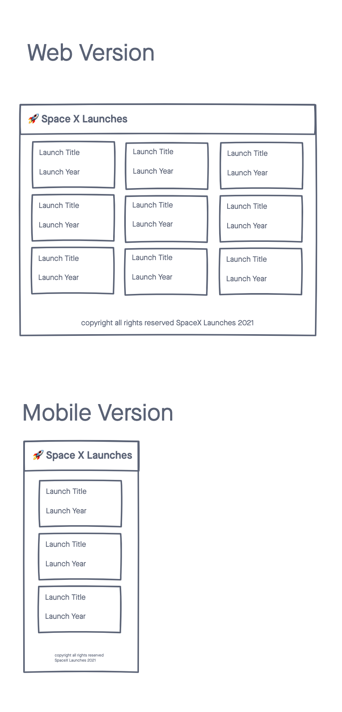
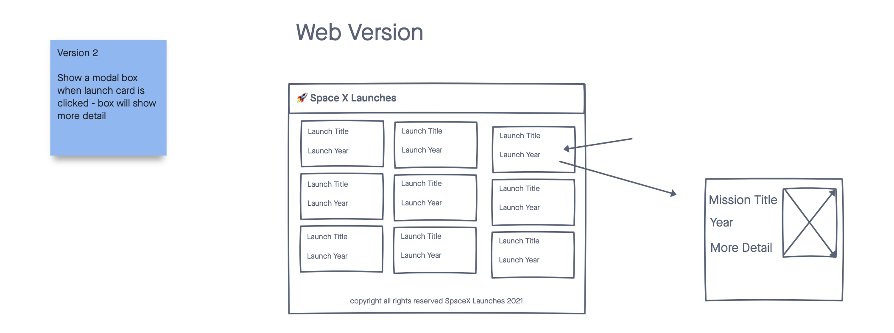

# 🚀 Space X Launches

A simple web app for visualizing Space X Launch Data

## Technologies
- HTML5
- CSS3
- JavaScript/jQuery
- [Space X API](https://docs.spacexdata.com/)

 
 

## Screenshots

 
 

### Wireframes

### Images of Working App

## Getting Started

[Click here](https://mydeveloperjourney.github.io/space-x-launches-app/) to see working app

## Future Enhancements
- Allow a user to save their favorite launches